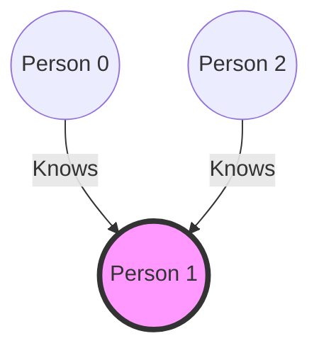

# 16. The Celebrity Problem

## Problem Statement

In a party of `N` people, only one person is known to everyone. Such a person may be present in the party, and if they are, they don't know anyone else in the party. This person is known as a **Celebrity**.

You are given a square matrix `M[][]` of size `N x N` representing the knowledge of people, where `M[i][j] = 1` means person `i` knows person `j`, and `M[i][j] = 0` means person `i` doesn't know person `j`.

Find the index of the celebrity. If there is no celebrity, return `-1`.

*Note: The diagonal elements `M[i][i]` will always be 0.*

### Example Visual Reference

In the graph below, Person **1** is the Celebrity.
- Person **0** knows **1**.
- Person **2** knows **1**.
- Person **1** knows nobody (no outgoing arrows).



## Expected Complexity
- **Time Complexity:** $O(N)$
- **Space Complexity:** $O(N)$ (for the Stack approach)

---

## Algorithm Concept (Stack Approach)

We can solve this problem optimally using a Stack:

1. **Push all elements:** Push all people from `0` to `N-1` onto the stack.
2. **Find a potential celebrity:** 
   - Pop the top two elements, say `A` and `B`.
   - If `A` knows `B` (`M[A][B] == 1`), then `A` cannot be the celebrity. We push `B` back onto the stack.
   - If `A` does not know `B` (`M[A][B] == 0`), then `B` cannot be the celebrity. We push `A` back onto the stack.
   - Repeat this until only one person remains in the stack.
3. **Verify the potential celebrity:** 
   - The remaining person is a *potential* celebrity. 
   - Iterate through all other people to confirm:
     - The celebrity must **not** know anyone: `M[potential][i] == 0` for all $i$.
     - Everyone must know the celebrity: `M[i][potential] == 1` for all $i \neq \text{potential}$.
   - If both conditions hold true, return the potential celebrity; otherwise, return `-1`.

---

## C++ Implementation

```cpp
#include <iostream>
#include <vector>
#include <stack>

using namespace std;

class Solution {
public:
    int celebrity(vector<vector<int>>& M, int n) {
        stack<int> s;
        
        // Step 1: Push all people to the stack
        for (int i = 0; i < n; i++) {
            s.push(i);
        }
        
        // Step 2: Find the potential celebrity
        while (s.size() > 1) {
            int a = s.top(); s.pop();
            int b = s.top(); s.pop();
            
            // If 'a' knows 'b', 'a' cannot be a celebrity, push 'b' back
            if (M[a][b] == 1) {
                s.push(b);
            } 
            // If 'a' doesn't know 'b', 'b' cannot be a celebrity, push 'a' back
            else {
                s.push(a);
            }
        }
        
        // Step 3: Verify the potential celebrity
        if(s.empty()) return -1;
        int candidate = s.top();
        
        for (int i = 0; i < n; i++) {
            if (i != candidate) {
                // If candidate knows someone OR someone doesn't know candidate
                if (M[candidate][i] == 1 || M[i][candidate] == 0) {
                    return -1;
                }
            }
        }
        
        return candidate;
    }
};

int main() {
    int n = 3;
    vector<vector<int>> M = {
        {0, 1, 0},
        {0, 0, 0},
        {0, 1, 0}
    };
    
    Solution obj;
    int celeb = obj.celebrity(M, n);
    
    if (celeb == -1) {
        cout << "No Celebrity present in the party." << endl;
    } else {
        cout << "Celebrity is person index: " << celeb << endl; // Output: 1
    }
    
    return 0;
}
```

## Two Pointers Approach (Alternative $O(1)$ Space)
You can also optimize the space complexity to $O(1)$ using two pointers:
1. Initialize `start = 0` and `end = N - 1`.
2. While `start < end`:
   - If `M[start][end] == 1` (start knows end), then `start` cannot be the celebrity, so `start++`.
   - Else (`start` doesn't know end), `end` cannot be the celebrity, so `end--`.
3. The remaining pointer (`start` or `end`) is the potential candidate. Verify it just like in the stack approach.
